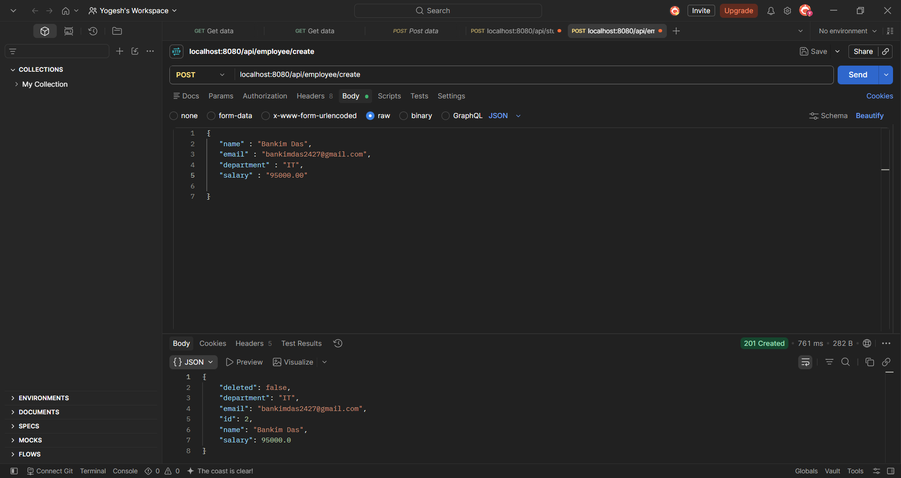
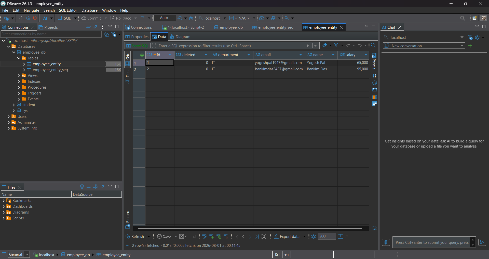

# Employee Management System

A RESTful CRUD application built using **Spring Boot**, **Spring Data JPA**, and **MySQL** to manage employee records.

---

## 🚀 Tech Stack

- Java
- Spring Boot
- Spring Data JPA (Hibernate)
- MySQL
- Maven
- Postman
- Git & GitHub

---

## 📌 Features

### ✅ Completed

- Create Employee API
- Spring Boot Layered Architecture
- REST API
- MySQL Integration
- Spring Data JPA
- Constructor Injection
- ResponseEntity
- JSON Request Handling

### 🚧 Upcoming

- Get All Employees
- Get Employee By ID
- Update Employee
- Delete Employee
- Exception Handling
- DTO
- Pagination & Sorting

---

## 📂 Project Structure

```
src
├── controller
│     └── EmployeeController
│
├── service
│     └── EmployeeService
│
├── repository
│     └── EmployeeRepository
│
├── entity
│     └── EmployeeEntity
│
└── EmployeeManagementSystemApplication
```

---

# API

## Create Employee

**POST**

```
/api/employee/create
```

### Request Body

```json
{
    "name":"Yogesh Pal",
    "department":"IT",
    "salary":65000.00,
    "email":"yogesh@gmail.com"
}
```

### Response

```
HTTP 201 CREATED
```

---

# Database

Employee table contains

- id
- name
- email
- department
- salary
- deleted

---

# 📸 Screenshots

## IntelliJ Project Structure


---

## Postman

### Create Employee API



---

## Database (DBeaver)

### Employee Table



---

# How to Run

### Clone Repository

```bash
git clone https://github.com/Pal-Yash/employee-management-system.git
```

### Open Project

Open the project in IntelliJ IDEA.

### Configure Database

Update your MySQL credentials in

```
src/main/resources/application.properties
```

Example

```properties
spring.datasource.url=jdbc:mysql://localhost:3306/employee_db
spring.datasource.username=root
spring.datasource.password=your_password

spring.jpa.hibernate.ddl-auto=update
spring.jpa.show-sql=true
```

### Run Application

Start the Spring Boot application.

### Test API

Use Postman to test the REST endpoints.

---

# Future Enhancements

- Get Employee API
- Update Employee API
- Delete Employee API
- Validation
- Exception Handling
- DTO
- Pagination
- Sorting

---

# Author

**Yogesh Pal**

GitHub: https://github.com/Pal-Yash